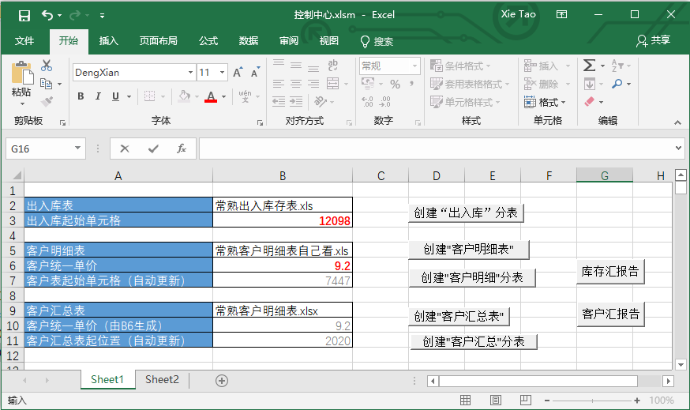

# Warehouse Excel VBA

Excel VBA contains lots of powerful features to deal with all kinds of complex data and requests, especially the **Macro** script.

Directly use of *macro script* in data workbook will cause long time of loading data. So, a better way is to store all kinds of *macro script* in a separate workbook, which only provides some GUIs, like buttons, to make the whole process as easy as possible.

Below is one example of a GUI sheet in a separate workbook with Chinese characters:

Each button binds one function in *controlCenter.vb*. The relationships(from left to right, and from top to bottom) are:

1. warehouseMainSheetToSubSheet
2. buildCustomerMainSheet
3. customerMainSheetToSubSheet
4. buildCustomerSummaryMainSheet
5. customerSummaryMainSheetToSubSheet
6. getRemainLengthDetails
7. getRemainCustomerDebts
